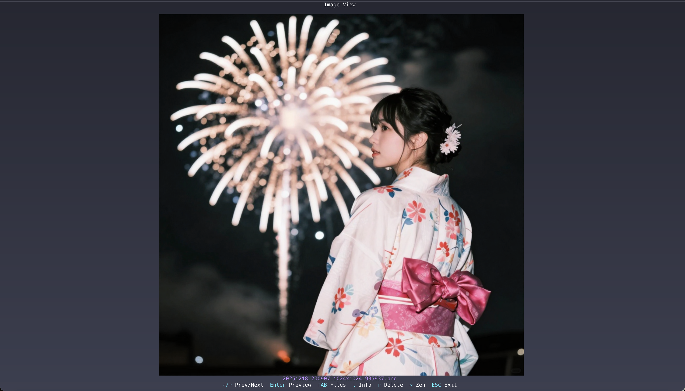

# PixelTerm-C - 高性能终端图像/视频/电子书浏览器


*[English](README.md) | 中文*

🖼️ 基于[Chafa](https://github.com/hpjansson/chafa)库编写的C语言高性能终端图像/视频/电子书浏览器。

## 概述

PixelTerm-C是原始PixelTerm应用的C语言实现，旨在提供显著更好的性能，同时保持所有相同的功能。通过直接利用Chafa库而不是使用子进程调用，我们消除了Python解释和外部进程创建的开销。

更新日志（英文）：见 `CHANGELOG.md`。

## 🌟 特性

- 🖼️ **多格式支持** - 支持JPG、PNG、GIF、BMP、WebP、TIFF等主流图像格式
- 🎬 **动画GIF支持** - 终端内播放动图，时序准确、渲染清晰
- 🎥 **视频播放** - 在终端内播放 MP4、MKV、AVI、MOV、WebM、MPEG/MPG、M4V 视频（仅视频，无音频）
- 📚 **电子书阅读** - 支持 PDF/EPUB/CBZ，提供页面预览与阅读模式（需 MuPDF）
- 🎨 **TrueColor渲染** - 全24位色彩支持，自动检测与优化
- 📁 **智能浏览** - 自动检测目录中的图像文件，支持目录导航
- ⌨️ **键盘导航** - 使用方向键在图像间切换，支持各种终端环境
- 📏 **自适应显示** - 自动适应终端大小变化
- 🎨️ **极简界面** - 无冗余信息，专注于图像浏览体验
- ⚡️ **高性能** - 比Python版本快5-10倍，内存使用显著降低
- 🔄 **循环导航** - 在首尾图像间无缝浏览
- 🏗️ **多架构支持** - 原生支持amd64和aarch64（ARM64）架构
- 🖱️ **鼠标支持** - 在所有模式下支持直观的鼠标导航、选择和滚动
- 🔎 **图片缩放** - 单图模式鼠标滚轮缩放（鼠标需在图像区域，视频/动图不支持）
- 📦 **预加载** - 图像预加载功能，实现更快导航（默认开启）。
- 🎨 **抖动** - 在色彩受限的终端中带来更好的视觉效果（默认关闭）。

## 性能对比

| 指标 | Python版本 | C版本 | 改进幅度 |
|--------|---------------|-----------|-------------|
| 启动时间 | ~1-2s | ~0.1-0.3s | 数倍提升 |
| 图像切换 | ~200-500ms | ~50-150ms | 2-5倍更快 |
| 内存使用 | ~50-100MB | ~15-35MB | 2-3倍减少 |
| CPU使用 | 高（Python + 子进程） | 中等（纯C） | 明显减少 |

## 📸 截图展示

以下是一张展示PixelTerm-C实际运行效果的截图：



*图片由zimage生成，终端使用：Warp*

当前测试中，图片效果相对最好、色彩还原度最高的终端：
- [rio](https://github.com/raphamorim/rio)
- [ghostty](https://github.com/ghostty-org/ghostty)
- [warp](https://www.warp.dev/)
- [iterm2](https://github.com/gnachman/iTerm2)
- [contour](https://github.com/contour-terminal/contour)

## 🚀 快速开始

### 安装依赖

```bash
# Ubuntu/Debian
sudo apt-get install libchafa-dev libglib2.0-dev libgdk-pixbuf2.0-dev libavformat-dev libavcodec-dev libswscale-dev libavutil-dev pkg-config build-essential
# 可选（电子书支持）：
sudo apt-get install libmupdf-dev

# Arch Linux
sudo pacman -S chafa glib2 gdk-pixbuf2 ffmpeg pkgconf base-devel
# 可选（电子书支持）：
sudo pacman -S mupdf
```

### 快速安装

```bash
# 使用包管理器安装（推荐）
# Arch Linux: paru -S pixelterm-c 或yay -S pixelterm-c

# 或下载对应架构的二进制文件
# AMD64:
wget https://github.com/zouyonghe/PixelTerm-C/releases/latest/download/pixelterm-amd64-linux
chmod +x pixelterm-amd64-linux && sudo mv pixelterm-amd64-linux /usr/local/bin/pixelterm

# ARM64:
wget https://github.com/zouyonghe/PixelTerm-C/releases/latest/download/pixelterm-arm64-linux
chmod +x pixelterm-arm64-linux && sudo mv pixelterm-arm64-linux /usr/local/bin/pixelterm

# macOS AMD64:
wget https://github.com/zouyonghe/PixelTerm-C/releases/latest/download/pixelterm-amd64-macos
chmod +x pixelterm-amd64-macos && sudo mv pixelterm-amd64-macos /usr/local/bin/pixelterm

# macOS ARM64 (Apple Silicon):
wget https://github.com/zouyonghe/PixelTerm-C/releases/latest/download/pixelterm-arm64-macos
chmod +x pixelterm-arm64-macos && sudo mv pixelterm-arm64-macos /usr/local/bin/pixelterm

# 注意：macOS用户如果因安全限制无法启动，请运行：
# xattr -dr com.apple.quarantine pixelterm-arm64-macos
```

### 源码构建

```bash
git clone https://github.com/zouyonghe/PixelTerm-C.git
cd PixelTerm-C
make

# 可执行文件输出在 pixelterm
# （或使用：sudo make install 安装到系统）
# 说明：若系统没有 MuPDF，会自动以无电子书支持的方式构建。

# 交叉编译到aarch64
make CC=aarch64-linux-gnu-gcc ARCH=aarch64
# 注意：交叉编译是实验性的，需要宿主系统正确安装对应的架构依赖库。
```

### 使用

见 [USAGE_zh.md](USAGE_zh.md)。

## 🎮 控制

见 [CONTROLS_zh.md](CONTROLS_zh.md)。
## 📄 许可证

LGPL-3.0或更高版本 - 详见LICENSE文件

本项目采用与[Chafa](https://github.com/hpjansson/chafa)相同的许可证（LGPLv3+）。

---

**PixelTerm-C** - 让终端成为出色的图像/视频/电子书浏览器！🖼️
